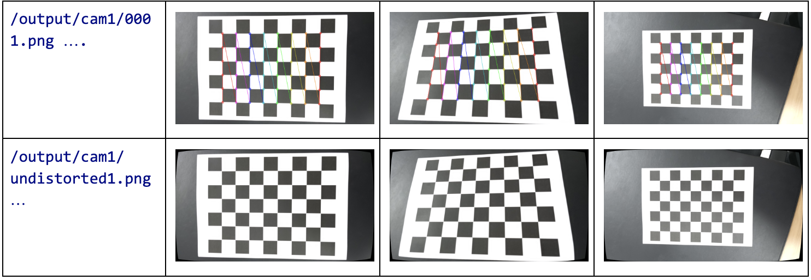
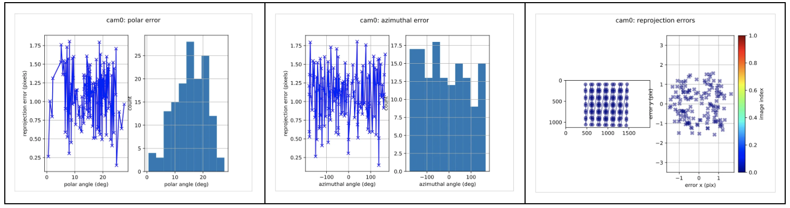

# Camera Calibration with Checkerboard and AprilTag

*LiengHongky Oct 2024*

## Content:

1. Calibration on theCAM1(Checkerboard)
2. Calibration on theCAM2(AprilTag)
3. Github: https://github.com/lienghongky/camera_calibration

## 1. Calibration on the CAM1(Checkerboard)

#### Data Info:

- Image type : Checkerboard
- Size: 28mm x 28mm

#### Requirement: opencv,numpy

#### Directory:

```
#Root
#├──data
#│ ├──cam
#│ │ ├──0001.png
#│ │ ├──0002.png
#│ │ ├──...
#│ │ └──1000.png
#│ └──cam
#│ ├──0001.png
#│ ├──0002.png
#│ ├──...
#│ └──1000.png
#├──main.py
#├──conf
#| ├──..
#| └──aprilgrid.yaml
#└──ouput
# ├──cam
# │ ├──0001.png
# │ ├──0002.png
# │ ├──...
# │ ├──calib.npz
# │ └──undistorted.png
# └──cam
# ├──cam2.bag
# ├──cam2-camchain.yaml
# ├──cam2-report-cam.pdf
# └──cam2-result-cam.txt
```
- Runscript:
``` #bash
python3 main.py
```
- Output:
```
Total error:  0.039553251283568
Distortion coefficients: [[ 0.17663727 -0.72023289 -0.00290819 -0.00145897  1.00971486]]

Intrinsic matrix:  
		        [[687.49794891   0.         489.23533409]
		         [  0.         687.76711878 279.3192835 ]
		         [  0.           0.           1.        ]]
```

**- Output files:**
- /output/cam1/0001.png ....
- /output/cam1/calib.npz
- /output/cam1/undistorted.png




## 2. Calibration on the CAM2 (AprilTag)

#### Data Info:

- Image type : AprilTag
- Tagsize: 21mm
- Space: 6mm
- Tag Spacing (ratio): 6/21 = 0.

## 2.1 Building ROS-Kalibr Docker Images

*Make sure docker is installed*

#### Step1: clone kalibr repo
```
git clone https://github.com/ethz-asl/kalibr.git
cd kalibr
```
#### Step2: build docker image

```dockerbuild -t kalibr -f Dockerfile_ros1_20_ . ```

#### Building completed we got a new image name kalibr:

```
(base)user:kalibrlienghongky$dockerbuild-tkalibr-fDockerfile_ros1_20_04.
[+]Building1514.2s( 10 / 10 )FINISHED docker:desktop-linux
=>[internal]loadbuilddefinitionfromDockerfile_ros1_20_04 0 .0s
=>=>transferringdockerfile:1.37kB 0 .0s
=>[internal]loadmetadatafordocker.io/osrf/ros:noetic-desktop-full 1.8s
=>[internal]load.dockerignore 0 .0s
=>=>transferringcontext: 2 B 0 .0s
=>[ 1 / 5 ]FROMdocker.io/osrf/ros:noetic-desktop-full@sha256: 637 e06dd30895c510efc3ae579e07e59e4bea36ebass48b3ba9aedf8 0 .0s
=>=>transferringcontext:165.49kB 0. 2 s
=>CACHED[ 2 / 5 ]RUNapt-getupdate&&DEBIAN_FRONTEND=noninteractive apt-getinstall-y gitwgetautoconfautoma 0 .0s
=>CACHED[ 3 / 5 ]RUNmkdir-p/catkin_ws/src&& cd/catkin_ws&& catkininit&& catkinconfig--extend/opt/ros/ 0 .0s
=>CACHED[ 4 / 5 ]ADD./catkin_ws/src/kalibr 0 .0s
=>[ 5 / 5 ]RUNCD/catkin_ws&&catkinbuild-j$(nproc) 1489.5s
=>exportingtoimage 22.3s
=>=>writingimagesha256:c0170e96658375eb04f2d51e197ea1549577dedwfd97fd2ada16f3d4b4efaf5697 0 .0s
=>=>namingtodocker.io/library/kalibr 0 .0s
Viewbuilddetails:docker-desktop://dashboard/build/desktop-linux/desktop-linux/hu4p6t911kpuqx02pbahucwwd
(base)user$
``` 
## 2.2 Spin up container:

#### Step1: Run the container with image we just built

```
FOLDER=/camera_calibration# change thisto rootdirectory of solution
xhost +local:root
dockerrun -it
-e"DISPLAY"
-e"QT_X11_NO_MITSHM=1" \
-v"/tmp/.X11-unix:/tmp/.X11-unix:rw" \
 -v"$FOLDER:/data" kalibr
```

#### Step2:Load ROS environment variables.

``` 
sourcedevel/setup.bash 
```

## 2.3 Camera Calibration

#### Step1: create bag from given images

- AprilTage images located at _/data/dataset/cam2/..._

```
rosrun kalibrkalibr_bagcreater --folder dataset/ --output-bag cam2.bag
```

**- Output:**
- Bag _:_ /output/cam2/cam2.bag
- topic:/cam2/image_raw, /cam2/image_raw


#### Step2: create conf file and run calibration

**_- /conf/aprilgrid.yaml_**
```#yaml
    target_type:'aprilgrid'
    tagRows: 6
    tagCols: 6
    tagSize:0.021#Thesizeofasingletaginmeters(e.g.,88mm)
    tagSpacing:0.28571#Thespacebetweentagsasafractionoftag_size
```
#### Step3: Run kalibr command
```
rosrun kalibr kalibr_calibrate_cameras
--bag ./output/cam2/cam2.bag
--target ./conf/aprilgrid.yaml
--models pinhole-radtan
--topics /cam2/image_raw

```
## 2.4 Result :

- output/cam2/cam2-camchain.yaml
    ```
    cam0:
       cam_overlaps:[]
       camera_model:pinhole
       distortion_coeffs:[0.04372654058025582,-0.12619885079976664,0.002105491005410376,-0.001333801300331733]
       distortion_model:radtan
       intrinsics:[1394.623336993793,1394.7220011095312,945.8941287923763,610.525874263081]
       resolution:[ 2000 , 1126 ]
       rostopic:/cam2/image_raw
    ```
- output/cam2/cam2-result-cam.txt
   ```
    Calibrationresults
    ====================
    Camera-systemparameters:
    cam0(/cam2/image __raw):_
       _type:<class'aslam__ cv.libaslam __cv__ python.DistortedPinholeCameraGeometry'>
       distortion:[0.04372654-0.12619885 0.00210549-0.0013338]+-[0.013763380.049119320.001180910.00117132]
       projection:[1394.623336991394.72200111 945.89412879 610.52587426]+-[0.52368001 0.52076137 8.
    10.49159778]
       reprojectionerror:[-0.000157,-0.000145]+-[0.805297,0.810678]

    Targetconfiguration
    ====================
    Type:aprilgrid
    Tags:
    Rows: 6
    Cols: 6
    Size:0.021[m]
    Spacing0.005999910000000001[m]
    ``` 

- output/cam2/cam2-report-cam.pdf


